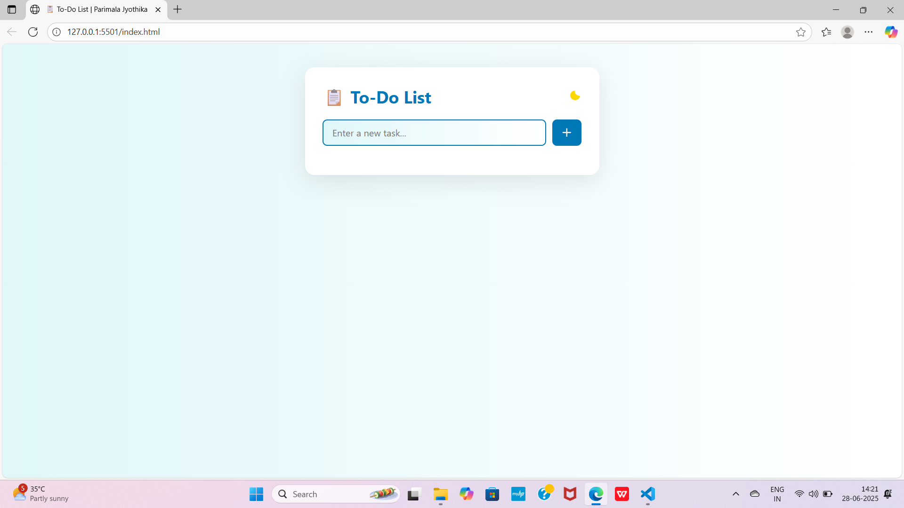

# 📋 To-Do List App

A simple and responsive task manager built using HTML, CSS, and JavaScript.  
Users can add, complete, and delete tasks with smooth light/dark mode switching. Tasks are saved locally in the browser using `localStorage`.

---

## ✨ Features

- ➕ Add tasks
- ✅ Mark tasks as completed
- 🗑️ Delete tasks
- 🌗 Toggle between Light & Dark mode
- 💾 Saves tasks locally using `localStorage`

---

## 📌 What It Does

A basic task tracker where users can manage their daily goals.  
Built to explore JavaScript-based interactivity and DOM manipulation.

---

## ⚙️ How It Works

- **HTML/CSS** build the UI layout and style
- **JavaScript** handles:
  - Task creation and deletion
  - Theme toggle
  - Real-time updates
  - Data storage using localStorage (no backend)

---

## 💡 Skills Gained

- JavaScript Basics  
- DOM Manipulation  
- Event Handling  
- Theme switching  
- Working with localStorage  
- UI/UX Design

---

## 🎯 Goal

To practice **real-time interactivity using JavaScript** and understand the structure of frontend apps.

---

## 🖼️ Project Preview

---

## 🎥 Live Demo 

[Click to watch the demo](https://drive.google.com/file/d/1VwFPWBZmjsZbFzWf0xIrVRv9RnOMywAP/view?usp=sharing)

---

## 🛠️ How to Run Locally

1. Download or clone the repository  
2. Open `index.html` in any web browser  
3. Start adding tasks!

---

## 👩‍💻 Developed By

**Parimala Jyothika**  
Web Developer | Internship Learner

---

